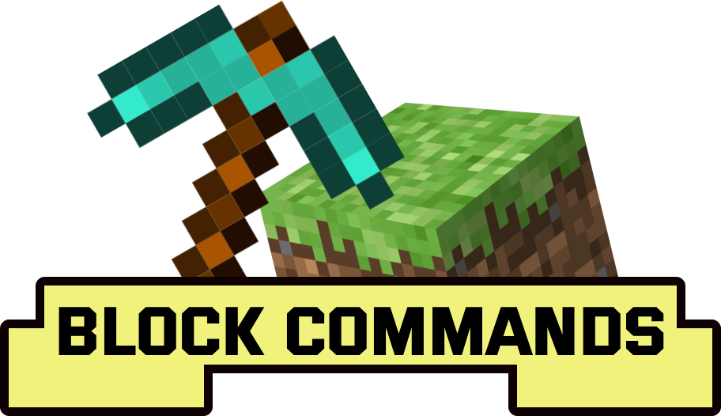

# BlockCommands

  

Allows commands to run when people punch, break, step, or interact with blocks.

A BlockCommand is an object that stores commands, blocks, areas, and events. When events happen in-game a BlockCommand is able to respond by running it's commands.

Tips:

1.  `/sudo` only runs commands if the message has a "/."
2.  You can inject information of the event inside of commands
    -   `{player}` will be replaced by the player's name when a BlockCommand is triggered.
    -   `{position}` will be the position of the block affected.

## Usage

1. Make a new BlockCommand with `/bc create <name> [...events]`. The `[...events]` is a list of available block events, separated by space, that will be enabled. Ex: `/bc create launchpad step interact`.
    - List all BlockCommands with `/bc list`.
    - You can delete a BlockCommand with `/bc remove <name>`.
2. Add a command to the BlockCommand with `/bc edit addcommand <name> <command>`.
    - List commands on a BlockCommand with `/bc edit listcommands <name>`.
    - Use the index of a command to remove it from a BlockCommand `/bc edit removecommand <name> <index>`.
    - Remove all commands from a BlockCommand with `/bc edit clearcommands <name> <index>`.
3. Add a block to the BlockCommand with `/bc edit addblock <name> <x> <y> <z>` or `/bc edit addblock <name>` to add the block you're looking at. You can also add whole areas with `/bc edit addarea <name> <x1> <y1> <z1> <x2> <y2> <z2>`. Blocks and areas that are on BlockCommands are called _attachments_.
    - List attachments on a BlockCommand with `/bc edit listattachments <name>`.
    - Use the index from the command to remove an attachment from a BlockCommand with `/bc edit removeattachment <name> <index>`.
    - Clear all attachments from a BlockCommand with `/bc edit clearattachments <name>`.
4. Configure the BlockCommand to run commands on different events with `/bc edit configure <name> [...events]`.

## Features

-   The plugin comes with several extra commands like `/launch` to make it easy to build specific contraptions like launchpads.
-   Editing commands for multiple blocks is quick since they are all stored on a single BlockCommand.

Commands can be run on the block events:

-   punch (When a player hits a block)
-   break (When a player destroys a block)
-   step (When a player first lands on a block)
-   interact (When a player right-clicks a block)

Commands can be attached to:

-   Blocks
-   Areas

## All Commands

Miscellaneous Commands

-   `/launch <direction-x> <direction-z> <direction-z> [player]`

Launches the player in the given direction. Use the `[player]` argument instead of `/sudo <player> ...` to bypass permission requirements.

"/launch 2 5 0" will launch the player who ran the command in the air

-   `/sudo <player> <message>`

Sends a message as the player. If the message starts with a "/" it will be ran as a command. Great for commands that needs commands to be sent as player. This will not give the player extra permissions.

`/sudo player1 /tp 0 0 0` will teleport the player to 0, 0, 0 if they have permission to use `/tp`

Admin Commands

_Key: `<name>` will be the name of a BlockCommand._

-   `/bc ...`
    You can also use /blockcommands.
-   `/bc help` or `/bc edit help`
    Fetches help for the following admin commands.
-   `/bc loadconfig`
    This reloads data from data.yml.
-   `/bc saveconfig`
    This saves data to data.yml.
-   `/bc create <name> [...events]`
    This makes a new BlockCommand with the given block events turned on. Valid `[...events]` are: punch, break, step, interact.
-   `/bc list`
    Lists all BlockCommands.
-   `/bc remove <name>`
    Removes a BlockCommand.
-   `/bc edit configure <name>`
    Lists all the block events for the BlockCommand.
-   `/bc edit configure <name> [...events]`
    Changes the BlockCommand events to `[...events]`. Ex: `/bc configure teleport_sign punch interact`
-   `/bc edit addcommand <name> <command>`
    Adds a command to a BlockCommand.
-   `/bc edit listcommands <name>`
    Lists commands on a BlockCommand and their index.
-   `/bc edit removecommand <name> <index>`
    Removes the command at the given index from the BlockCommand.
-   `/bc edit addblock <name> <x> <y> <z>`
    Adds the block at `<x> <y> <z>` to the BlockCommand.
-   `/bc edit addblock <name>`
    Adds the block the player is looking at to the BlockCommand.
-   `/bc edit addarea <name> <x1> <y1> <z1> <x2> <y2> <z2>`
    Adds an area to the block command starting from `<x1> <y1> <z1>` ending at `<x2> <y2> <z2>`.
-   `/bc edit listattachments <name>`
    Lists the blocks and areas along with their indexes that are attached to the BlockCommand.
-   `/bc edit removeattachment <name> <index>`
    Removes the block or area at `<index>` from the BlockCommand.
-   `/bc edit clearattachments <name>`
    Removes all blocks and areas associated with the BlockCommand.
